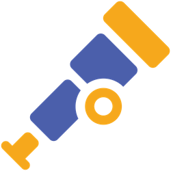

<style>
/* Ensure presenter notes are visible. */
.dark .prose {
  color: white;
}
.light .prose {
  color: black;
}
</style>

<h1>
<strong>
<span class="text-orange">Open</span>
<span class="text-blue">Telemetry</span>
Logs
</strong><br>
<u>Driving a Major Shift</u>
</h1>

## Events, Richer Data, and Smarter Semantics

<h2 class="text-purple">v1.1.0</h2>

<div class="pt-12">
  by Robert Pająk
</div>

<div>
  pellared @
  <a href="https://github.com/pellared" target="_blank" alt="GitHub" title="Open in GitHub"
    class="text-xl slidev-icon-btn opacity-50 !border-none !hover:text-white">
    <carbon-logo-github />
  </a>
</div>

<https://pellared.github.io/otel-logs-talk>

<!--
Hi everyone!
I want to start with a disclaimer.
This an updated version of my talk that I gave a few months ago.
-->

---
layout: center
class: text-center
---

# trash logs

<div class="text-left">

```log
[2025-09-10 14:22:01] INFO: It works
[2025-09-10 14:22:02] INFO: Still works
[2025-09-10 14:22:03] INFO: Yep, still working
[2025-09-10 14:23:44] ERROR: Failed
[2025-09-10 14:25:10] DEBUG: User payload: {"user":"alice","password":"hunter2"}
[2025-09-10 14:26:30] WARN: Something went wrong!!!
StackTrace: java.lang.Exception: oh no
at com.company.module.Class.method(Class.java:42)
at com.company.module.Other.method(Other.java:99)
at com.company...
(more 800 lines)
LOGGING HERE ----------------------------------
value=1
LOGGING HERE ----------------------------------
value=2
LOGGING HERE ----------------------------------
value=3
```

</div>

<div class="text-2xl">
Who has seen logs like this? 🙋‍♂️
</div>

<!--
Let me begin with a quick question.
Please raise your hand if you have seen logs like this.

*Say what part of the audience have their hands up.*

We've ALL been there.
"LOGGING HERE" with dashes, passwords in debug logs.
-->

---
layout: statement
---

# THIS is why<br>we need better logging standards

<!--
Wasted logs cost money, slow down applications, and add noise.

THIS is why we need better logging standards.
-->

---
layout: center
---

# on the other side...

<div class="text-xl text-left mx-auto space-y-6 max-w-4xl">

<div class="flex items-center gap-4 p-4 bg-gray-800 rounded-lg border-l-4 border-yellow">
  🐧 <span class="font-mono text-yellow">tracepoints & user_events</span> <span class="text-gray ml-2"> Linux event tracing</span>
</div>

<div class="flex items-center gap-4 p-4 bg-gray-800 rounded-lg border-l-4 border-orange">
  🐧 <span class="font-mono text-orange">eBPF</span> <span class="text-gray ml-2"> Linux kernel dynamic instrumentation</span>
</div>

<div class="flex items-center gap-4 p-4 bg-gray-800 rounded-lg border-l-4 border-blue">
  🪟 <span class="font-mono text-blue">ETW</span> <span class="text-gray ml-2"> Event Tracing for Windows</span>
</div>

<div class="flex items-center gap-4 p-4 bg-gray-800 rounded-lg border-l-4 border-green">
  🐹 <span class="font-mono text-green">Go runtime tracing</span> <span class="text-gray ml-2"> event tracing built into the Go runtime</span>
</div>

<div class="mt-4 text-2xl text-center text-purple font-bold">
  Structured + Fast ⚡
</div>

</div>

<!--
But on the other side of the spectrum, far away from these noisy logs, there are technologies that have been doing structured event telemetry right for decades.

OS kernels and language runtimes emit events with known structure, typed fields, and near-zero overhead.

The lesson from these systems? Structure and performance are not opposites. You can have both.
That's exactly the direction we are aiming.
-->

---
layout: center
---

<h1 class="flex gap-2">
<code>uname</code>
<span class="flex gap-2">
  
  <strong>
    <span class="text-orange">Open</span>
    <span class="text-blue">Telemetry</span>
  </strong>
</span>
</h1>

<div class="text-2xl text-left mx-auto space-y-6 max-w-3xl">

A **framework** for generating, processing, and exporting telemetry data:

📊 **traces**

📈 **metrics**

📝 **logs (and events)**

🔍 **profiles**

<div class="text-xl mt-8 text-orange">
  One standard to observe them all 💍
</div>


</div>

<!--
When I talk about "we", I mean OpenTelemetry.

For those who might be new to OpenTelemetry, let me give you a quick overview.

OpenTelemetry is a framework for generating, processing, and exporting telemetry data.
It provides a unified approach to observability across different signals such as traces, metrics, logs, events, profiles.

The beauty of OpenTelemetry is that it gives you one standard way to instrument your applications, regardless of the language or backend you're using.
Whether you're sending data to Jaeger, Prometheus, Splunk, or any other observability platform, OpenTelemetry provides the common foundation.
-->

---
layout: center
---

# `whoami`

<div class="text-2xl text-left mx-auto space-y-6 max-w-3xl">
<v-clicks>

‍💻 Robert Pająk, [@pellared](https://github.com/pellared) on GitHub

🌴 Contributing to OTel Logs since Nov 2023

🔧 [OTel Go](https://github.com/open-telemetry/opentelemetry-go) maintainer

🧾 [OTel Specification](https://github.com/open-telemetry/opentelemetry-specification) sponsor

💼 Software Engineer at [Splunk a Cisco company](https://www.splunk.com)

<div class="text-lg mt-8 opacity-80">
  <strong>🇵🇱 Disclaimer:</strong> Non-native English speaker.<br/>
</div>
</v-clicks>
</div>

<!--
Ah, my bad manners.
Maybe I should introduce myself?

[click] I am Robert Pająk. You can find me on GitHub as pellared, probably creating some issue or opening yet another pull request.

[click] I've been actively contributing to OpenTelemetry Logs since November 2023. Yet, I have been working with different logging systems (including high throughput) for a lot longer time.

[click] I am responsible for designing and development of OpenTelemetry Go Logs.

[click] I am also part of the OpenTelemetry Logs Special Interest Group that works on the development of OpenTelemetry Logs and Events across the whole OpenTelemetry ecosystem.

[click] I'm a Software Engineer at Splunk, a company that embraces logging, where I get paid for working on open source.

[click] I am not an English native speaker.
But if something is not clear, don't blame my English.
It simply means I have no idea what I am talking about.
-->

---
layout: center
---

# `init()`

<div class="text-2xl text-left mx-auto space-y-6 max-w-3xl">

<v-clicks>

🔧 syntax

📚 semantics

⚡  api

</v-clicks>

</div>

<!--
During the talk we are going to explore the following areas in the context of OpenTelemetry:

[click] the data model of logs,

[click] the semantics of logs and events,

[click] the Logs API.

I hope that by the end of this talk, you'll understand why logs in OpenTelemetry are no longer just about bridging your logs from logging libraries and frameworks into OpenTelemtry SDK, but a first-class citizen among other OpenTelemetry signals. We are also going to see how it is affecting other areas of OpenTelemetry.
-->

---
layout: section
---

# syntax

<!--
What does a proper log record look like in OpenTelemetry? Let's talk about the Logs Data Model.
-->

---
layout: center
class: text-center
---

<h1>
<strong>
<span class="text-orange">Open</span>
<span class="text-blue">Telemetry</span>
Logs
</strong>
Data Model
</h1>
<div class="text-2xl text-left mx-auto space-y-6 max-w-3xl">
<v-clicks>

```json {1-2|3-5|6|7-8|9|10-15|16-20|21-23}
"Timestamp": "2023-11-15T09:15:20.250Z",
"ObservedTimestamp": "2023-11-15T09:15:20.251Z", 
"TraceId": "b8c9d0e1f2a3b4c5d6e7f8a9b0c1d2e3",
"SpanId": "c1d2e3f4a5b6c7d8",
"TraceFlags": 1,
"EventName": "db.client.operation.exception",
"SeverityText": "WARN",
"SeverityNumber": 17,
"Body": "Exception occurred while fetching user data: Connection timeout after 3000ms",
"Attributes": {
  "exception.type": "java.sql.SQLTransientConnectionException",
  "exception.message": "Connection timeout after 3000ms",
  "user.id": "alice",
  "db.operation.name": "SELECT"
},
"Resource": {
  "service.name": "user-service",
  "service.version": "1.5.2", 
  "deployment.environment": "staging"
},
"InstrumentationScope": {
  "Name": "org.example.user.controller.UserController"
}
```


<span class="text-xl mb-6 text-orange">
  Not just strings with timestamps.
</span>
<span class="mt-8 text-xl font-bold text-blue">
  Structured logs that carry context.
</span>

</v-clicks>
</div>

<!--
In OpenTelemetry, a log record isn't just a string with a timestamp. It's a structured piece of telemetry with:

[click] timestamps when it happened and when it was captured

[click] trace context for correlation magic

[click] event name that identifies the type of the log record

[click] proper severity level

[click] human-readable log message

[click] any additional metadata or log fields

[click] Resource allows identifying the software that emitted the log record

[click] Instrumentation scope containing information about the source code that emitted the log record

[click]
This isn't just making your regular logging more complicated.

[click]
It is structured logging that actually integrates with your traces.
-->

---
layout: center
---

# complex data

<div class="mb-8">
  <div class="text-2xl text-blue mb-4">
    <code class="text-orange">Attribute</code>  values can be complex
    (<code class="text-green">AnyValue</code>).
  </div>
  
  <div class="text-2xl">
    <code class="text-green">AnyValue</code> can be one of:
  </div>
</div>

<div class="grid grid-cols-1 gap-4 max-w-4xl mx-auto text-xl">
<v-clicks>

<div class="flex items-center gap-4 p-4 bg-gray-800 rounded-lg border-l-4 border-blue">
  🔤 <span class="font-mono text-blue">primitive value</span> <span class="text-gray">(<code>string</code>, <code>int</code>, <code>bool</code>, <code>double</code>)</span>
</div>

<div class="flex items-center gap-4 p-4 bg-gray-800 rounded-lg border-l-4 border-green">
  📋 <span class="font-mono text-green">array of AnyValue</span>
</div>

<div class="flex items-center gap-4 p-4 bg-gray-800 rounded-lg border-l-4 border-purple">
  🗂️ <span class="font-mono text-purple">map of string to AnyValue</span>
</div>

<div class="flex items-center gap-4 p-4 bg-gray-800 rounded-lg border-l-4 border-yellow">
  💾 <span class="font-mono text-yellow">byte array (BLOB)</span>
</div>

<div class="flex items-center gap-4 p-4 bg-gray-800 rounded-lg border-l-4 border-gray">
  ⚪ <span class="font-mono text-gray">empty value</span>
</div>

</v-clicks>
</div>

<!--
The attribute values in OpenTelemetry logs can contain complex data structures. Not just simple strings and numbers. The value can be:

[click] primitive value like text, number or boolean value,

[click] an array of any value, meaning that the first item in an array can be a string and the second item can be an integer

[click] a map of string to any value, meaning you can compose any nested structure,

[click] or even a binary object,

[click] at last it can be nothing.

You can approximate it to something like BSON format.
-->

---
layout: center
---

# Complex values

```json
"gen_ai.request.model": "gpt-4",
"gen_ai.usage.input_tokens": 110,
"gen_ai.usage.output_tokens": 45,
"gen_ai.input.messages": [
  {
    "role": "system",
    "content": "You are a helpful and knowledgeable AI assistant from Splunk."
  },
  {
    "role": "user",
    "content": "What is OpenTelemetry?"
  }
],
"gen_ai.output.messages": [
  {
    "role": "assistant",
    "content": "OpenTelemetry is an open-source observability framework for collecting telemetry data."
  }
]
```

<div class="mt-6 text-lg">
  <span class="text-green">✨</span> Rich, structured, meaningful data!
</div>

<!--
Here is are some examples of complex attributes based on the GenAI semantic conventions.

As you can see, you can log entire payloads, complex error objects, or structured events without flattening them into strings.

The would be no need to reconstruct object hierarchies from JSON-encoded strings.
-->

---
layout: statement
---

# Complex values are supported across ALL signals

Read more: [Announcing Support for Complex Attribute Types in OTel](https://opentelemetry.io/blog/2025/complex-attribute-types/)

<!--
But wait, there's more! These complex values are supported across ALL OpenTelemetry signals: traces, metrics, and profiles.

This is no longer just a logging feature.
-->

---
layout: section
---

# semantics

<!--
We've got structure.
But how do we make sure everybody calls things the same way so we can actually search, correlate, merge data from five services written by five teams?
-->

---
layout: section
---

# log vs event

<!--
OpenTelemetry distinguishes between Log Records and Event Records.

Log Record is for general-purpose logging, human-readable, "something happened."

Event Record is a well-defined occurrence with stronger semantics, "this specific thing happened."
-->

---
layout: statement
---

<h1>
An Event Record<br>
is a Log Record<br>
with an <span class="text-orange">event name</span><br>
and a <span class="text-blue">well-known structure</span>.
</h1>

Read more: [OpenTelemetry Logging and You](https://opentelemetry.io/blog/2025/opentelemetry-logging-and-you/)

<!--
An Event Record is a Log Record with an event name and a well-known structure.
-->

---
layout: center
---

<div class="grid grid-cols-2 gap-8 text-lg">

<div class="text-left">

### Log

```json
{
  "Body": "Product purchased successfully",
  "SeverityNumber": 9,
  "SeverityText": "INFO", 
  "Attributes": {
    "product": "telescope",
  }
}
```

</div>

<div class="text-left">

### Event

```json
{
  "EventName": "product.purchase",
  "SeverityNumber": 9,
  "Attributes": {
    "product.id": 1024
  }
}
```

</div>

</div>

<div class="text-center mt-8 text-xl text-green">
  Same data model, different semantics.
</div>

<!--
Why the distinction?

Because not every log your application emits deserves to be treated like something meaningful.

Events are intentional, instrumented with purpose, not sprinkled around like debugging salt.

This matters because platforms can now treat Events as first-class citizens.

You can index them differently, correlate them intelligently, and maybe even generate useful alerts instead of just noise.
-->

---
layout: statement
---

<h1>
<span class="text-orange">Open</span>
<span class="text-blue">Telemetry</span>
<br>
Semantic Conventions
</h1>

Making logs searchable & comparable

<div class="text-2xl font-bold text-green mb-6">
  Same semantics = Better queries and dashboards
</div>

<!--
That's where semantic conventions come in.

Think of them as telemetry guidelines containing a giant shared dictionary of attribute names that all SDKs, libraries, instrumentation, and software agree to use.
-->

---
layout: center
---

# Semantic conventions registry

<div class="text-xl text-left mx-auto space-y-6 max-w-4xl">
<v-clicks>

<div class="flex items-center gap-4 p-4 bg-gray-800 rounded-lg border-l-4 border-blue">
  🔗 <span class="font-mono text-blue">cross-cutting</span> <span class="text-gray ml-2"><code>code.line_number</code>, <code>error.type</code>, <code>service.name</code></span>
</div>

<div class="flex items-center gap-4 p-4 bg-gray-800 rounded-lg border-l-4 border-purple">
  📝 <span class="font-mono text-purple">signal-specific</span> <span class="text-gray ml-2"><code>log.record.uid</code>, <code>log.iostream</code></span>
</div>

<div class="flex items-center gap-4 p-4 bg-gray-800 rounded-lg border-l-4 border-orange">
  🌐 <span class="font-mono text-orange">domain-specific</span> <span class="text-gray ml-2"><code>http.method</code>, <code>db.system</code>, <code>gen_ai.request.model</code></span>
</div>

</v-clicks>
</div>

<!--
The semantic conventions registry is organized into groups.

[click] Cross-cutting attributes apply across many signals and use cases: code.line_number tells you where it broke, error.type gives you the actual error, and service.name tell you what application broke.

[click] Signal-specific attributes only make sense for a particular signal, like log.record.uid or log.iostream for log records.

[click] Domain-specific attributes are focused on protocols, systems, and shiny new tech like HTTP, databases, or GenAI.
-->

---
layout: center
---

# Semantic conventions also guide *how* to emit

<div class="text-xl text-left mx-auto space-y-6 max-w-4xl">
<v-clicks>

<div class="flex items-center gap-4 p-4 bg-gray-800 rounded-lg border-l-4 border-blue">
  📦 <span class="font-mono text-blue">event structure</span> <span class="text-gray ml-2">what attributes an event must and should contain</span>
</div>

<div class="flex items-center gap-4 p-4 bg-gray-800 rounded-lg border-l-4 border-red">
  🚨 <span class="font-mono text-red">exception events</span> <span class="text-gray ml-2">how to record errors with full context</span>
</div>

<div class="flex items-center gap-4 p-4 bg-gray-800 rounded-lg border-l-4 border-orange">
  🤖 <span class="font-mono text-orange">gen_ai events</span> <span class="text-gray ml-2">prompt, response, and tool call payloads</span>
</div>


</v-clicks>
</div>

<div v-click class="mt-8 text-2xl text-center text-purple font-bold">
  Not just naming — also <em>behavior</em>.
</div>

<!--
Semantic conventions don't just define attribute names.
They also specify guidelines and best practices for how to emit telemetry correctly.

[click] Event conventions define the expected structure of an event: required fields, recommended fields, and how to pick the right severity level, and what the body should contain.

[click] For example, the exception event convention tells you exactly how to record an error: which attributes are required, how to capture the stack trace.

[click] Domain specific, e.g. GenAI semantic conventions, defining how to capture AI prompts, responses, and tool calls as structured events so any platform can understand and query them.

[click] In short, semantic conventions guide not just naming, but behavior — ensuring every library and SDK emits telemetry in a consistent, interoperable way.
-->

---
layout: section
---

# api

<!--
Until recently, OpenTelemetry Logs were mostly about getting logs from file streams or bridging logs from existing logging frameworks like log4j, Serilog, or Python's logging module.

But what if you want to log directly using OpenTelemetry APIs?

What if you want to emit those beautiful structured events we've been talking about?
-->

---
layout: center
---

# User-facing logging API

```go
// Emit an event record.
logger.WarnEvent(ctx, "rate_limit.approached",
    semconv.ClientIP("192.168.1.100"),            // Reuse attribute from semantic conventions.
    attribute.Int("rate_limit.max_per_sec", 100), // Custom application-specific attribute.
) 
```

<div class="text-xl text-left mx-auto space-y-4 max-w-4xl mb-8">
<v-clicks>

🚀 No format conversion

✨ Full feature access

🎯 Consistency

</v-clicks>
</div>

<div class="grid grid-cols-2 gap-8 text-xl max-w-4xl mx-auto">
  <div v-click class="text-center p-6 bg-blue-900 rounded-xl border-2 border-blue-400">
    <div class="text-4xl mb-4">🔧</div>
    <div class="text-blue-400 font-bold mb-2">Instrumentation Authors</div>
    <div class="text-sm text-gray-300">Library & framework developers</div>
  </div>
  
  <div v-click class="text-center p-6 bg-green-900 rounded-xl border-2 border-green-400">
    <div class="text-4xl mb-4">👩‍💻</div>
    <div class="text-green-400 font-bold mb-2">Application Developers</div>
    <div class="text-sm text-gray-300">Business logic & features</div>
  </div>
</div>

<!--
Now let's talk the user-facing OpenTelemetry logging API.
This is the piece that finally gives developers a proper, first-class way to emit logs directly through OpenTelemetry.

[click] There is no need to go through traditional logging libraries and have the bridge overhead.

[click] You can use complex attributes. 

[click] You can also reuse the attributes across signals.

[click] It is critical for libraries and frameworks adding OpenTelemetry instrumentation to make sure to not couple it to any other library like log4j.

[click] But it is all the piece that finally gives developers a proper, first-class way to emit logs directly through OpenTelemetry.

The best part? It plays nicely with existing logging.
You can gradually migrate, use both approaches, or pick the right tool for each job.

It's not about replacing everything. It's about giving you options.
-->

---
layout: center
---

# `Enabled` API

<div class="grid grid-cols-2 gap-8 text-lg">

<div v-click class="text-left">

Before ❌

```go
// Always does the work
logger.Info(ctx, "User operation",
  formatMessage(),             // CPU cycles!
  buildComplexAttributes()...) // Memory allocs!
```

<div class="text-red mt-4">
  🐌 Wasted CPU cycles<br/>
  📈 Memory allocations<br/>
</div>

</div>

<div v-click class="text-left">

After ✅

```go
// Check first, work later
if logger.InfoEnabled(ctx) {
  logger.Info(ctx, "User operation",
    formatMessage(),          // Smart!
    buildComplexAttributes()) // Only when needed!
}
```

<div class="text-green mt-4">
  ⚡ Zero overhead when disabled<br/>
  🎯 Work only when necessary
</div>

</div>

</div>

<!--
Now, let's talk about performance.

[click]
Because what good is amazing structured logging if it kills your application's performance?

[click]
OpenTelemetry recently added an Enabled API.
It is a way to check if logging is actually needed before you do all the expensive work of building log records.
Think of it as "measure twice, cut once" but for telemetry.

The idea is simple: before you spend CPU cycles formatting messages, serializing complex objects, or building those beautiful structured attributes, you ask: "Hey, is anyone actually going to process this log?"
If the answer is no, you skip all the work.
-->

---
layout: center
---

# `Enabled` functionality

<div class="text-left mx-auto space-y-6">

<v-clicks>

⚡ Check before you emit records to skip expensive work

🚀 A door for better integrations

<Youtube id="Ej-z2WwWWak" />

</v-clicks>

</div>

<!--
[click]
This Enabled functionality doesn't just make the OpenTelemetry Logs faster.

[click]
It opens the door to hooking into extremely performant, OS-native tracing systems like Linux user_events and 
ETW (Event Tracing for Windows).
These systems are so fast they make regular logging look like writing with a pen.

[click]
If you want the deep dive, check out the presentation by Cijo Thomas & Chris Gray: "Beyond OTLP: Unlocking the Potential of OS-native Tracing".
-->

---
layout: statement
---

# `Enabled` API is being added to ALL signals

<!--
But here's where it gets really exciting.

Enabled has been added to other signals to offer the same functionality.
-->

---
layout: section
---

# span events → log events

<!--
All of this progress around logs and events leads us to one of the biggest upcoming changes in OpenTelemetry: the deprecation of the Span Events API.
-->

---
layout: center
---

# Two ways to emit events is one too many

<div class="text-xl text-left mx-auto space-y-6 max-w-4xl">
<v-clicks>

<div class="flex items-center gap-4 p-4 bg-gray-800 rounded-lg border-l-4 border-yellow">
  🕸️ <span class="font-mono text-yellow">Span Events</span> <span class="text-gray ml-2"><code>Span.AddEvent()</code>, <code>Span.RecordException()</code> via Tracing API</span>
</div>

<div class="flex items-center gap-4 p-4 bg-gray-800 rounded-lg border-l-4 border-green">
  📝 <span class="font-mono text-green">Log-based Events</span> <span class="text-gray ml-2">named events emitted via the Logs API</span>
</div>

</v-clicks>
</div>

<div v-click class="mt-8 text-xl text-left mx-auto max-w-4xl space-y-3 text-red">
  ❌ Split guidance for instrumentation authors <br>
  ❌ Duplicate concepts for users <br>
  ❌ Slower evolution as improvements must land in two places <br>
</div>

<!--
Until now, OpenTelemetry offered two competing ways to emit events correlated with traces:

[click] Span Events, created by calling Span.AddEvent or Span.RecordException on a span through the Tracing API.

[click] Log-based Events, emitted through the Logs API and correlated with the active trace context.

[click] Having both creates split guidance for instrumentation authors, duplicate mental models for users, and means every improvement to the event model has to be specified and implemented twice.
-->

---
layout: statement
---

<h1>
Deprecating <span class="text-yellow">Span Event API</span>,<br>
not the ability to see
events on spans.
</h1>

Read more: [Deprecating Span Events API](https://opentelemetry.io/blog/2026/deprecating-span-events/)

<!--
The plan is clear: deprecate the API for recording span events, not the span event data model itself.

Existing span event data stays valid, and backends can still surface events in span timeline views.
What changes is the recommended way to write new events.
-->

---
layout: center
---

# What is changing

<div class="text-xl text-left mx-auto space-y-6 max-w-4xl">
<v-clicks>

<div class="flex items-center gap-4 p-4 bg-gray-800 rounded-lg border-l-4 border-red">
  🚫 <span class="font-mono text-red">deprecation</span> <span class="text-gray ml-2"><code>Span.AddEvent()</code> and <code>Span.RecordException()</code></span>
</div>

<div class="flex items-center gap-4 p-4 bg-gray-800 rounded-lg border-l-4 border-green">
  ✅ <span class="font-mono text-green">preferred</span> <span class="text-gray ml-2">emit (log-based) events via the Logs API</span>
</div>

<div class="flex items-center gap-4 p-4 bg-gray-800 rounded-lg border-l-4 border-blue">
  🔄 <span class="font-mono text-blue">compatibility</span> <span class="text-gray ml-2">SDKs can transform log-based events back onto span events</span>
</div>

<div class="flex items-center gap-4 p-4 bg-gray-800 rounded-lg border-l-4 border-purple">
  📐 <span class="font-mono text-purple">semconv</span> <span class="text-gray ml-2">next major versions migrate events to use Logs API</span>
</div>

</v-clicks>
</div>

<!--
Here is what is actually changing:

[click] The Tracing API methods Span.AddEvent and Span.RecordException are going to be deprecated.

[click] The Logs API is going to be the single recommended way to emit events, including exceptions.

[click] SDKs will provide a compatibility layer that can project log-based events back onto spans, so backends that show events in trace views keep working.

[click] Semantic conventions will migrate events and exceptions to log-based definitions in their next major versions, while keeping existing behavior stable.
-->

---
layout: center
---

# `tl;dr;`

### syntax

📝 Logs are more than strings

⚡ Structure unlocks superpowers  

### semantics

🎯 Semantic conventions = consistency

✨ Events are logs with well-known structure

### api

🔧 Direct usage

🚀 Performance and integration improvements

<div class="text-xl mt-8">
  <span class="text-orange">Performance</span> + 
  <span class="text-blue">Rich telemetry</span> +
  <span class="text-green">Integrations</span> = 💖
</div>

<!--
What did we learn today?
Let me summarize this journey through the chaotic world of logs.

We've all been writing trash logs. "LOGGING HERE" with dashes?
We've ALL been there. But trash logs cost money, slow down apps, and make observability engineers cry into their coffee.

In OpenTelemetry, logs are structured and can contain complex data.
Moreover, complex attributes are going to also arrive to other signals.
OpenTelemetry has semantic conventions that not only define the attributes, but also distinguish between log and event records.
Logs are getting faster too.

That's the kind of evolution that should make everyone happy: developers get better observability, operations get cleaner data.
-->

---
layout: center
---

# Thank You!

This presentation: <https://github.com/pellared/otel-logs-talk>

<div class="text-lg mx-auto space-y-2">

<span v-click class="text-2xl">Special thanks 🙏</span>

<v-clicks>

- Liudmila Molkova, Trask Stalnaker, Ted Young, Austin Parker
- Tyler Yahn, Cijo Thomas, Jonathan Amsterdam
- OpenTelemetry Go and Specification SIG
- Everyone who raised their hands
- GenAI (sic!)

</v-clicks>
</div>

<div v-click>
<div class="mt-8 text-xl text-red">
  Don't let your logs be trash 🗑️
</div>
<div class="text-2xl mb-2 text-green">
  May your logs be structured! 🎉
</div>
<div class="flex text-2xl gap-2">
  
  <strong>
    <span class="text-orange">Open</span>
    <span class="text-blue">Telemetry</span>
  </strong>
  ❤️
</div>
</div>

<br>

<div v-click class="text-xl">

**GitHub**: [@pellared](https://github.com/pellared)

[**CNCF Slack**](https://slack.cncf.io/): Robert Pajak
</div>

<!--
Thank you all for listening.
I hope you learned something useful today.

[click] Special credits to

[click] People who continuously help with all the logs work

[click] Those who helped me a lot during implementation of logs in OTel Go 

[click] OTel contributors for reviewing my pull requests and providing a lot of comments

[click] Everyone who raised their hands during the "trash logs" section; your honesty is appreciated. Also thank you for all those that asked questions.

[click] GenAI and Copilot that helped me a lot in preparing the presentation.

[click] Now go forth and log responsibly!

[click] Find me on GitHub as pellared or CNCF Slack as Robert Pajak.
-->
